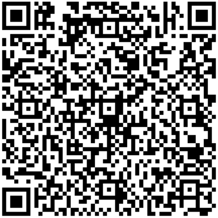

<h1 align="center"> EFI Lenovo Yoga 520-14IKB Intel-core i7 8th Generation </h1>
<h3 align="center"> Hackintosh EFI partition with support for macOS (Monterey) </h3>

Absolutely usable with full touchscreen & digitizer experience

# What works
- Full iGPU support Intel UHD (even path tracing tested), OpenCL also works
- Keyboard with lighting and shortcuts for brightness and volume
- __touchpad with gestures__ 🤍
- __touch screen__ 🤍
- __digitizer__ (aka stylus) 🤍

Other stuff
  
- wifi (has been replaced by an Intel 7265)
- usb 3.0 e USB type-C.
- battery indicator.
- webcam
- card Reader
- audio
- HDMI connection (video and audio).
- brightness control keys f11 e f12. 
- volume control.
- connect audio jack with microphone. 

___Please reset NVRAM everytime you startup your PC, otherwise touchpad & touchscreen & digitizer will not work___

# What does not work
- sleep mode (either touchscreen works or (sleep mode & battery if you won't reset NVRAM))
- Fingerprint reader
- working from battery causes sudden reboots
- any VPN + WiFi casues reboots sometimes
- airdrop

# Characteristics
- Screen: 14 inches with HD resolution (1366 x 768 pixels) and touch sensitive & digitizer,
- Processor: Core i8 8th gen,
- RAM memory: 16 GB,
- Graphics Card: Intel UHD,
- Storage: SSD 256 GB, SSD 128 GB
- Ports and Interfaces: USB 3.0, USB-C, HDMI, headphone jack, Bluetooth and Wi-Fi, memory card reader
- Dimensions: 33 x 23.5 x 1.9 cm,
- Weight: 1.74 kilos

## Original repo
### Donate PayPal - scan the QRcode below and give any value.
<h3 align="center">Help maintain this project. Thank you 🍺  
<a href="mailto:ricardos7@hotmail.com">ricardos7@hotmail.com</a>
</h3>

<form action="https://www.paypal.com/donate" method="post" target="_top" align="center">
<input type="hidden" name="hosted_button_id" value="Z4V3GZF3ACE84" />
<input type="image" src="https://www.paypalobjects.com/en_US/i/btn/btn_donateCC_LG.gif" border="0" name="submit" title="PayPal - The safer, easier way to pay online!" alt="Donate with PayPal button" />

</form>

### Doações por PIX - leia o QRcode abaixo e doe qualquer valor.
<h3 align="center">Ajude a manter esse projeto. Obrigado 🍺 </h3>

# Credits
 - <a href="https://github.com/Ricardo-SS"> Ricardo-SS </a>
 - <a href="https://github.com/acidanthera"> Acidanthera </a>
 - <a href="https://github.com/dortania"> Dortania </a>
 - <a href="https://bitbucket.org/RehabMan/"> Rehabman </a>
 - <a href="https://www.olarila.com/profile/2-mald0n/"> MaLd0n </a>
 - <a href="https://github.com/OpenIntelWireless"> OpenIntelWireless </a>
 - <a href="https://github.com/zhen-zen"> zhen-zen </a>
 - <a href="#"> And others </a>
